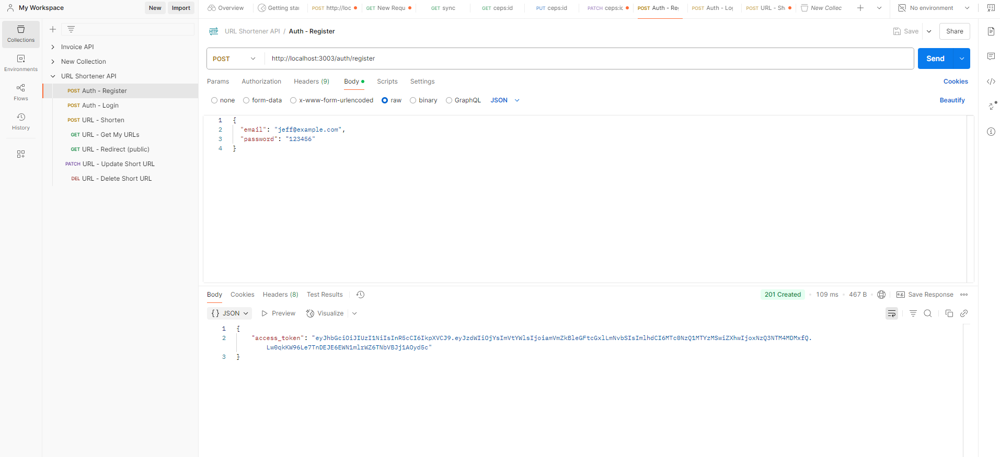
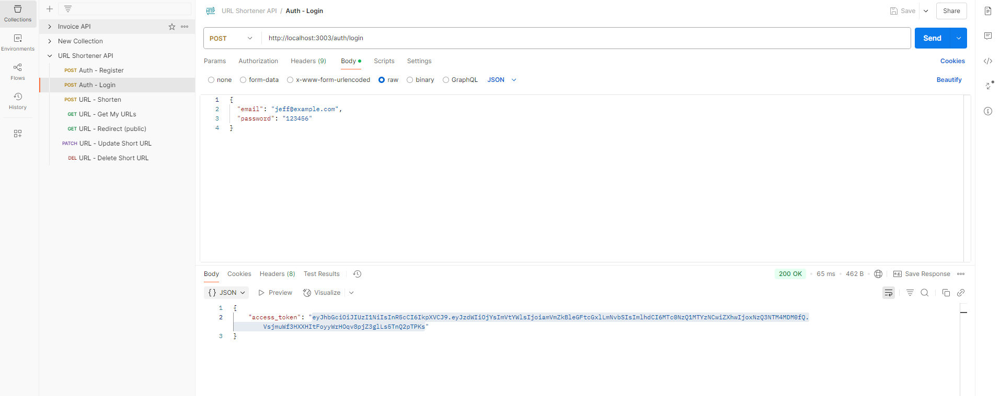
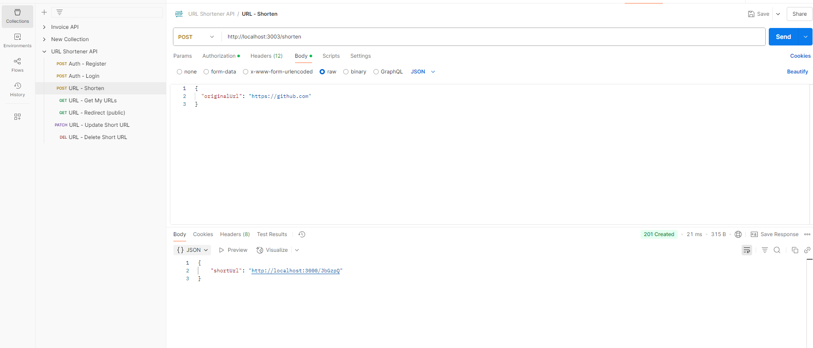
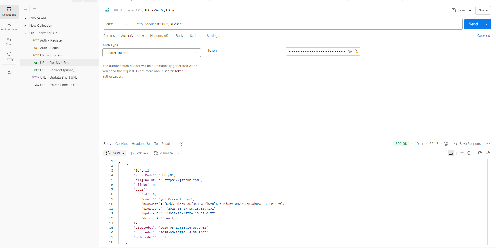
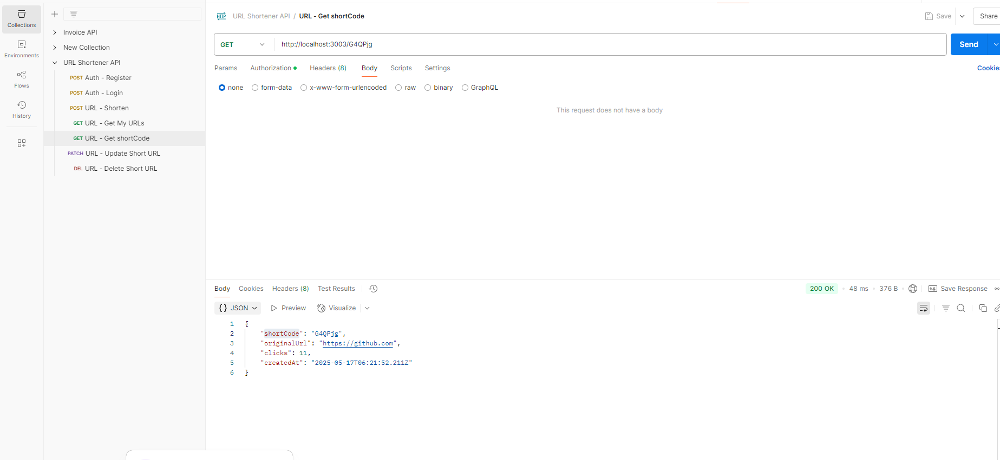
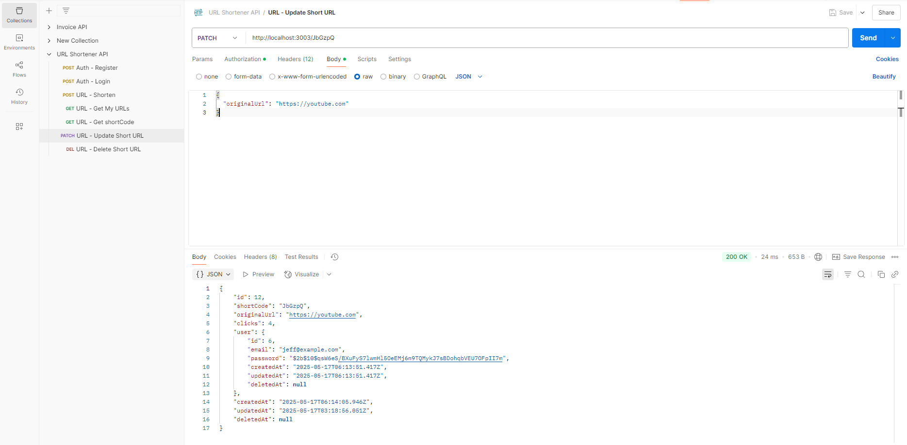
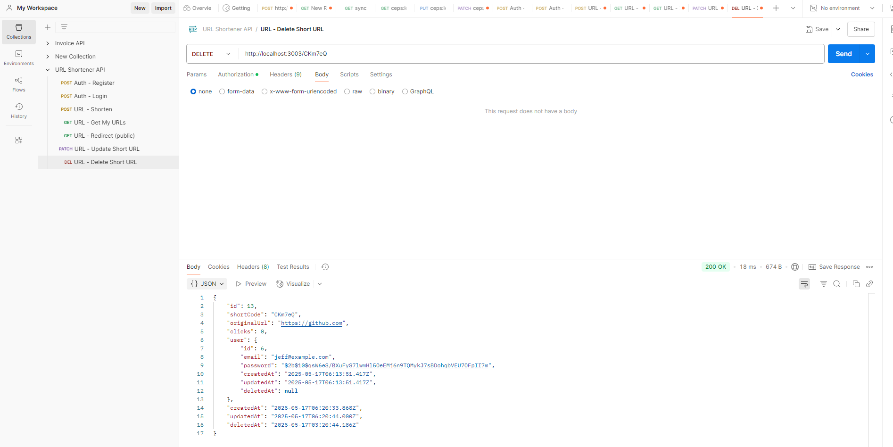
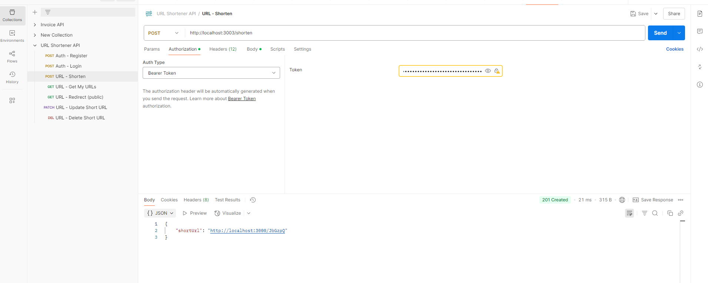

# URL Shortener API

API para encurtamento de URLs construída com NestJS e MySQL, com autenticação JWT e Docker.

---

## Tecnologias utilizadas

- Node.js + NestJS
- MySQL (via Docker)
- JWT para autenticação
- Docker e Docker Compose para orquestração do ambiente

---

## Pré-requisitos

- [Node.js](https://nodejs.org/)
- [Docker](https://www.docker.com/) (uso obrigatório)
- [Docker Compose](https://docs.docker.com/compose/)

---

## Configuração do projeto

### 1. Clonar o repositório

```bash
git clone <https://github.com/JeffersonMeira99/url.git>
cd <url>
```

### 2. Instalar dependências

```bash
npm install
```

### 3. Criar arquivo `.env`

Na raiz do projeto, crie um arquivo `.env` com o seguinte conteúdo:

```env
# JWT
JWT_SECRET="eyJhbGciOiJIUzI1NiIsInR5cCI6IkpXVCJ9.e30.ZRrHA1JJJW8opsbCGfG_HACGpVUMN_a9IV7pAx_Zmeo"
JWT_EXPIRATION_TIME="21600"

# MySQL (host do container exposto na porta 3307)
MYSQL_HOST="127.0.0.1"
MYSQL_PORT="3307"
MYSQL_USER="bd-user-url"
MYSQL_PASSWORD="url1234"
MYSQL_DATABASE="bd_url"


```

### 4. Rodar o projeto com Docker

Execute o comando abaixo para subir o container do MySQL e da aplicação:

```bash
docker-compose up --build
```

Isso iniciará:

- Banco de dados MySQL acessível localmente na porta 3307

---

## Uso da API

### Autenticação

- **A maioria das rotas é protegida e requer um token JWT válido no header:**

```
Authorization: Bearer <seu_token_jwt>
```

- Rotas públicas incluem:

  - Registro (`POST /auth/register`)
  - Login (`POST /auth/login`)

### Exemplos de chamadas

#### Registro

```http
POST http://localhost:3000/auth/register
Content-Type: application/json

{
  "email": "usuario@exemplo.com",
  "password": "senha123"
}
```

#### Login

```http
POST http://localhost:3000/auth/login
Content-Type: application/json

{
  "email": "usuario@exemplo.com",
  "password": "senha123"
}
```

Resposta contém o token JWT.

#### Criar URL encurtada (rota protegida)

```http
POST http://localhost:3000/shorten
Authorization: Bearer <seu_token_jwt>
Content-Type: application/json

{
  "originalUrl": "https://github.com"
}
```

---

## Comandos úteis

| Comando                     | Descrição                                      |
| --------------------------- | ---------------------------------------------- |
| `npm install`               | Instala dependências                           |
| `docker-compose up --build` | Sobe containers do MySQL e app                 |
| `docker-compose down`       | Para e remove containers                       |
| `npm run start:dev`         | Roda o projeto em modo desenvolvimento (watch) |

---

## Observações

- A configuração do banco está definida no arquivo `.env` e deve ser mantida conforme o exemplo.
- Para testar as rotas protegidas, utilize ferramentas como Postman ou Insomnia e insira o token JWT no header `Authorization`.

---

## Endpoints da API de Encurtamento de URL

### 1. Criar URL Encurtada (rota protegida)

```http
POST /shorten
Authorization: Bearer <seu_token_jwt>
Content-Type: application/json

{
  "originalUrl": "https://github.com"
}
```

**Resposta 201:**

```json
{
  "shortCode": "a1b2c3",
  "originalUrl": "https://github.com",
  "userId": 1,
  "clicks": 0,
  "createdAt": "2025-05-17T15:30:00.000Z"
}
```

---

### 2. Obter informações da URL pelo código curto (rota pública)

```http
GET /:shortCode
```

Exemplo:

```http
GET /a1b2c3
```

**Resposta 200:**

```json
{
  "shortCode": "a1b2c3",
  "originalUrl": "https://github.com",
  "clicks": 10,
  "createdAt": "2025-05-10T12:00:00.000Z"
}
```

---

### 3. Listar URLs do usuário autenticado (rota protegida)

```http
GET /urls/user
Authorization: Bearer <seu_token_jwt>
```

**Resposta 200:**

```json
[
  {
    "shortCode": "a1b2c3",
    "originalUrl": "https://github.com",
    "clicks": 10,
    "createdAt": "2025-05-10T12:00:00.000Z"
  },
  {
    "shortCode": "d4e5f6",
    "originalUrl": "https://nestjs.com",
    "clicks": 5,
    "createdAt": "2025-05-12T08:00:00.000Z"
  }
]
```

---

### 4. Atualizar URL pelo código curto (rota protegida)

```http
PATCH /:shortCode
Authorization: Bearer <seu_token_jwt>
Content-Type: application/json

{
  "originalUrl": "https://github.com/nestjs/nest"
}
```

Exemplo:

```http
PATCH /a1b2c3
```

**Resposta 200:**

```json
{
  "shortCode": "a1b2c3",
  "originalUrl": "https://github.com/nestjs/nest",
  "clicks": 10,
  "updatedAt": "2025-05-17T16:00:00.000Z"
}
```

---

### 5. Remover URL (soft delete) pelo código curto (rota protegida)

```http
DELETE /:shortCode
Authorization: Bearer <seu_token_jwt>
```

Exemplo:

```http
DELETE /a1b2c3
```

**Resposta 200:**

```json
{
  "message": "URL soft deleted successfully"
}
```

---

### Images Api










## Os exemplos de requisição para importar no Postman etc, estão disponíveis em:

> Pasta

docs > api

## Para importar no Postman:

Abra o Postman.

Clique em Import (no canto superior esquerdo).

Selecione a aba File.

Escolha os arquivos JSON dentro da pasta docs/api.

As coleções serão importadas com todos os detalhes configurados (endpoints, métodos, headers, bodies etc).

### Nota

- Para todas as rotas protegidas, insira o token JWT no header:

```
Authorization: Bearer <seu_token_jwt>
```
